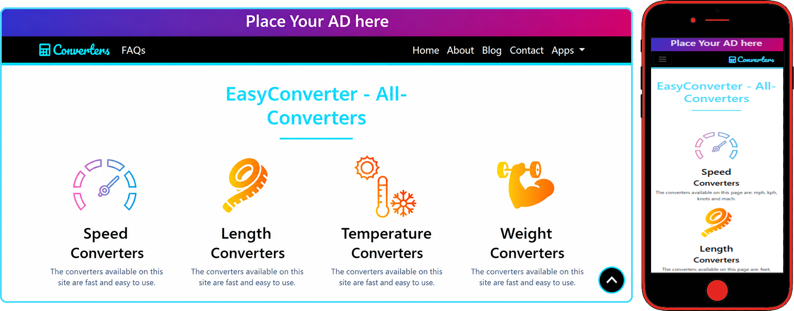

# Conversion-Tools-with-Admin-Panel
This website is built using HTML, CSS, and Bootstrap, with JavaScript and jQuery powering the converter tools and the admin panel.

## 🛠️ Built With
* **Frontend:** HTML5, CSS3, Bootstrap4
* **Logic & Functionality:** JavaScript, jQuery (Used for converter tools and the admin panel)
* **CRUD:** JavaScript & jQuery

# Pages:
- index
- about
- blog
- contact
- apps
  - speed
  - length
  - temperature
  - weight
  - hash
  - vize&final
  - kdv
- privacy policy
- references
- faqs

# Admin Panel Details
- User Name : admin
- Password : 1234

# Pages of Admin Panel
- index(Login Page)
- dashboard
- tasks
- mails
- users
- logs
- security

# Image

<picture>

</picture>
